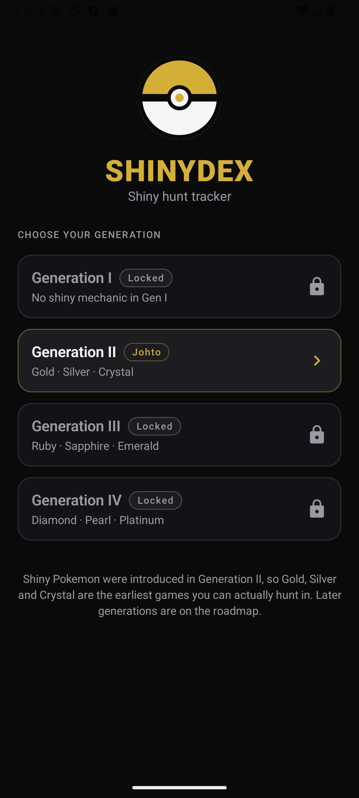
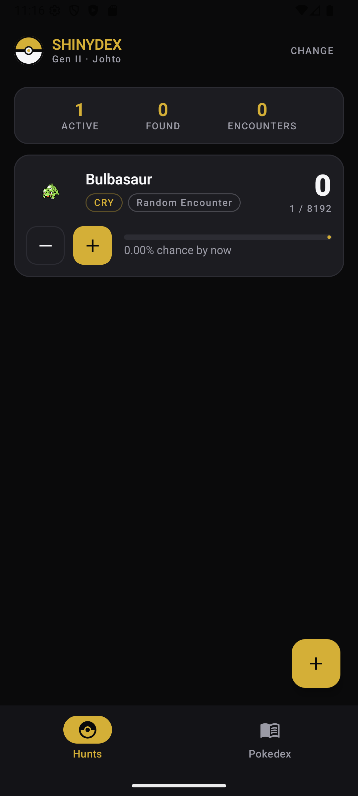
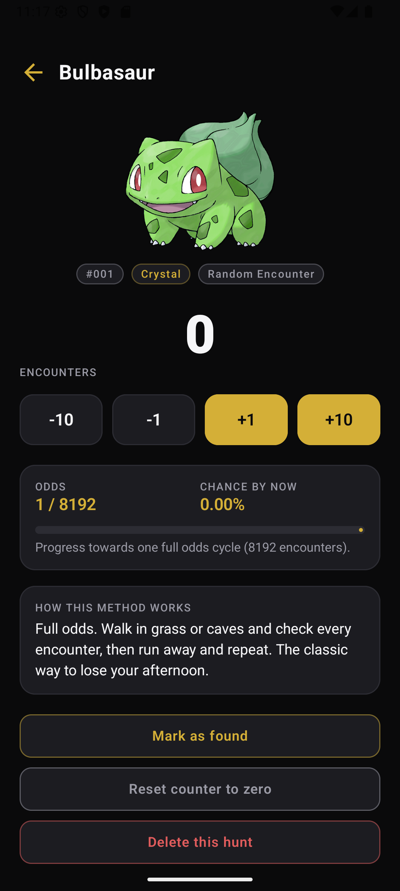
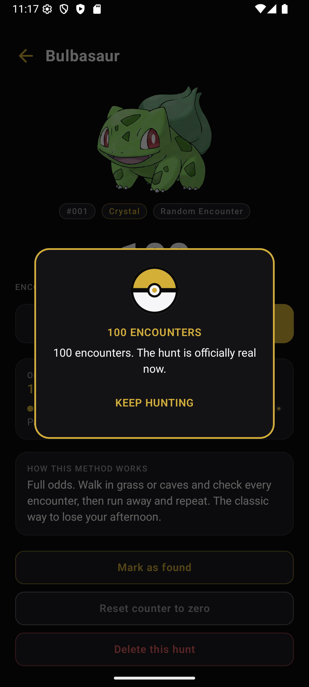
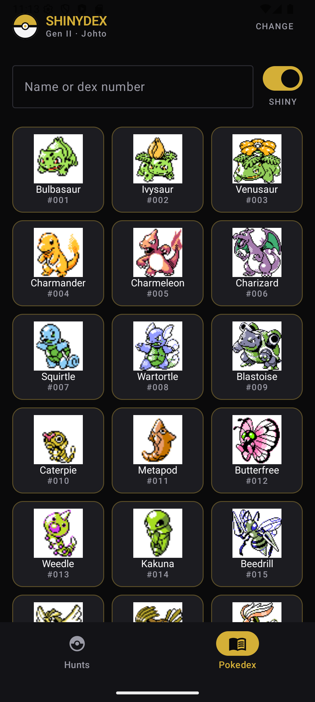
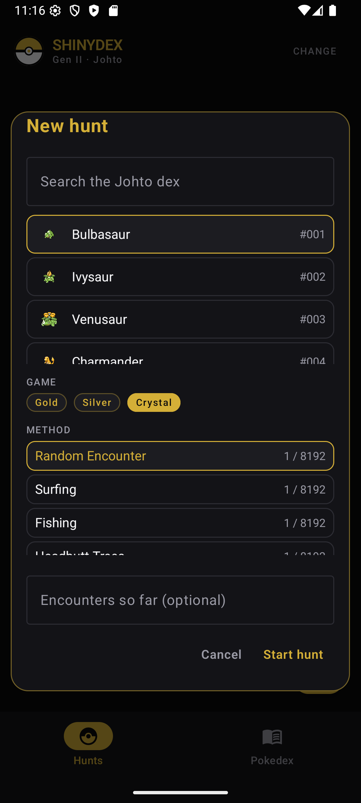

# ShinyDex

Rastreador de cazas shiny para Android que cubre las **generaciones II, III y IV**, hecho en
Kotlin con Jetpack Compose. Negro, dorado y blanco, con una Poké Ball como logo.

> **Estado: versión 0.1.0, usable pero no final.** Compila, se instala y funciona; el flujo
> completo se probó en un emulador con Android 16 (API 36). Lo pendiente está en
> [Limitaciones y mejoras](#limitaciones-y-mejoras).

---

## Una generación a la vez

Al elegir una generación, **toda la app** se limita a esa región: sus Pokémon, sus juegos, sus
métodos y el estilo de sus sprites. Si eliges Hoenn, ves Hoenn: del #252 al #386 con sprites de
Emerald, los juegos Ruby / Sapphire / Emerald y solo los métodos que existen en ellos.

| Generación | Región | Pokédex | Juegos | Sprites |
|---|---|---|---|---|
| **II** | Johto | #152–251 (100) | Gold · Silver · Crystal | Crystal |
| **III** | Hoenn | #252–386 (135) | Ruby · Sapphire · Emerald | Emerald |
| **IV** | Sinnoh | #387–493 (107) | Diamond · Pearl · Platinum | Platinum |

**La generación I está bloqueada a propósito:** en Red, Blue y Yellow no existían los Pokémon
shiny, así que no hay nada que cazar.

Solo se incluyen los juegos cuya Pokédex es la de su propia región. FireRed, LeafGreen,
HeartGold y SoulSilver son remakes con la Pokédex de otra región, así que romperían la regla de
una generación, una Pokédex.

## Capturas

| Elegir generación | Mis cazas | Detalle de una caza |
|---|---|---|
|  |  |  |

| Mensaje de Milestone | Pokédex (shiny activado) | Nueva caza |
|---|---|---|
|  |  |  |

*Capturadas en un emulador con API 36, versión 0.1.0.*

## Funciones

- **Elegir generación:** Gen II, III o IV; la Gen I sigue bloqueada. La elección limita toda la
  app y se recuerda; “CHANGE” en la barra de arriba regresa a esa pantalla.
- **Mis cazas:** cada caza es una tarjeta con el sprite shiny, el juego, el método, el contador
  y botones **+ / −** directamente en la tarjeta. Arriba, un resumen suma las cazas activas, los
  shinies encontrados y los encuentros totales.
- **Detalle de una caza:** contador grande con −10 / −1 / +1 / +10, la probabilidad real del
  método, la probabilidad acumulada (“chance by now”), una barra de progreso hacia un ciclo
  completo de probabilidad y una explicación de cómo funciona ese método en el juego.
- **Mensajes de ánimo (Milestones):** aparecen cada 100 encuentros, con mensajes especiales en
  los números importantes (1,000 · 4,096 · **8,192** · 10,000…).
- **Pokédex:** los Pokémon de la generación elegida, tomados de [PokéAPI](https://pokeapi.co),
  con un **interruptor shiny** que cambia todos los sprites entre normal y shiny. Al tocar uno
  se ven sus tipos, altura, peso, estadísticas base, **su entrada de Pokédex del juego de esa
  generación** (Crystal, Emerald o Platinum) y el arte normal y shiny lado a lado.
- **Face-off:** cazar con amigos en tiempo real, en modo **Battle** (todos el mismo Pokémon, gana
  el primero) o **Lounge** (cada quien el suyo). Ver [Face-off](#face-off-multijugador).
- **Funciona sin internet:** la Pokédex se guarda en Room después de la primera carga; las cazas
  individuales nunca necesitan red.

## Face-off (multijugador)

Un jugador crea una sala y comparte su código de seis caracteres (o el enlace
`shinydex://join/CÓDIGO` del botón de compartir). Cualquiera con el código entra desde la
pestaña **Face-off**. Cada sala admite hasta 8 jugadores y se queda en una sola generación.

| Modo | Todos cazan | Termina cuando | Qué se ve |
|---|---|---|---|
| **Battle** | El Pokémon que eligió el anfitrión | El primero toca **Found it!**: gana y los contadores de los demás se bloquean | Posiciones y la probabilidad de que *alguien* ya lo haya encontrado, sumando los encuentros de todos: `1 − (1 − 1/d)^(n₁+n₂+…)` |
| **Lounge** | Cada quien el suyo, de la Pokédex de la sala | Todos encontraron el suyo | Posiciones, cuántos lo encontraron y los encuentros combinados |

Los contadores se sincronizan cada dos segundos, y los Milestones siguen saliendo cada 100 de
*tus* encuentros. Las salas las administra un servidor propio hecho en Kotlin con Ktor (módulo
`server` de este proyecto); viven en memoria y se cierran solas tras 12 horas sin actividad.

### Reglas que valida el servidor

- Cada jugador recibe una llave secreta aleatoria al entrar; solo esa llave puede mover su
  contador, marcar su shiny o sacarlo de la sala. Las llaves nunca aparecen en lo que ven los
  demás.
- Un solo ganador por Battle: el candado de la sala hace imposible un segundo “found” al mismo
  tiempo.
- El Pokémon tiene que ser de la generación de la sala; los nombres se limpian y no se pueden
  repetir; los contadores se mueven máximo ±10 por petición y nunca quedan negativos.
- Los códigos no usan 0/O ni 1/I para que no se confundan al dictarlos.

## Métodos de caza

La probabilidad base es 1 entre 8192 en las tres generaciones. Lo que cambia es qué la mejora.

**Generación II:** encuentro normal, surf, pesca, árboles con Headbutt, soft reset, bestia
errante, concurso de bichos, premio del casino, y además:

| Método | Probabilidad | Notas |
|---|---|---|
| Crianza (padre shiny) | 1 / 64 | Lo shiny depende de los DVs, y los DVs se heredan |
| Odd Egg | ~14% | **Solo en Crystal**: la opción desaparece en Gold y Silver |
| Gyarados rojo | Garantizado | Shiny fijo en el Lago de la Furia |

**Generación III:** encuentro normal, surf, pesca, Rock Smash, Zona Safari, soft reset,
Latias / Latios errantes y crianza. Todos son 1/8192: la Gen III quitó la herencia de DVs y el
método Masuda todavía no existía, así que no hay atajo.

**Generación IV:** encuentro normal, surf, pesca, soft reset, árboles de miel, Gran Pantano,
errantes, y además:

| Método | Probabilidad | Notas |
|---|---|---|
| Cadena de Poké Radar | ~1 / 200 | La mejor de la Gen IV; con una cadena de 40 |
| Método Masuda | 1 / 1638 | Criar padres de juegos de distinto idioma |

## Tecnologías

| Capa | Elección |
|---|---|
| Lenguaje / interfaz | Kotlin, Jetpack Compose, Material 3 |
| Arquitectura | MVVM: `ViewModel` + `StateFlow`, flujo de datos en un solo sentido |
| Inyección de dependencias | `AppContainer` hecho a mano (cuatro pantallas no necesitan Hilt) |
| Almacenamiento | Room (cazas y caché de la Pokédex), SharedPreferences (generación y sala activa) |
| Red | Retrofit + Gson sobre un cliente OkHttp compartido y con tiempos límite |
| Imágenes | Coil 3, usando el mismo cliente OkHttp |
| Navegación | Navigation Compose, enlace profundo `shinydex://join/CÓDIGO` |
| Servidor de Face-off | Ktor 3 (motor CIO) + Gson, salas en memoria |
| Compilación | Gradle 9.5, AGP 9.3.2, Kotlin 2.4.10, KSP, catálogo de versiones |

---

## Instalación

1. Abrir la carpeta `ShinyDex` en Android Studio (**File → Open** y elegir la carpeta).
2. Esperar a que Gradle sincronice. Usa el JDK que trae Android Studio; no hay que configurar
   nada.
3. Elegir un emulador o celular con Android 8.0 (API 26) o superior y presionar **Run**.

Desde una terminal:

```bash
gradlew :app:assembleDebug
```

El APK queda en `app/build/outputs/apk/debug/app-debug.apk`.

### Requisitos

- Android Studio con **SDK Platform 37** y un emulador o celular con API 26 o superior.
- Un JDK 21 instalado, solo para la tarea `detektSast` (ver abajo).

---

## Pruebas

```bash
gradlew :app:testDebugUnitTest :server:test
```

**60 pruebas.** Las 20 del servidor cubren las reglas del Face-off (un ganador por Battle, el
Lounge solo cierra cuando todos terminan, llaves, validación de generación, límites y
expiración) y la API completa por HTTP. Las 40 de la app cubren el cálculo de probabilidad, los
Milestones, los rangos de cada generación y sus sprites, qué entrada de Pokédex se muestra y
cómo se limpia su texto, y las reglas de métodos por generación: que el Odd Egg sea solo de
Crystal, que ningún método se pase a otra generación y que la Gen III de verdad no tenga nada
mejor que 1/8192. También los códigos de sala, los enlaces de invitación y la probabilidad
combinada de una Battle.

## Seguridad

Los documentos completos están en [`security/`](security/).

| Práctica | Herramienta | Comando | Documento |
|---|---|---|---|
| **SAST** | detekt + Android Lint | `gradlew :app:detektSast :app:lintDebug` | [SAST.md](security/SAST.md) |
| **DAST** | MobSF (+ OWASP ZAP) | `bash security/mobsf-scan.sh <apk>` | [DAST.md](security/DAST.md) |
| **SCA** | OWASP Dependency-Check | `gradlew -PenableSca=true -PnvdApiKey=<llave> :app:dependencyCheckAnalyze` | [SCA.md](security/SCA.md) |
| **SAC** | Caso de aseguramiento de seguridad | — | [SAC.md](security/SAC.md) |

> **Por qué `detektSast` y no el plugin de detekt:** el plugin corre detekt dentro del daemon de
> Gradle, y detekt 1.23.x no reconoce la versión de Java 25, que es con la que corre el daemon
> de este proyecto (`gradle/gradle-daemon-jvm.properties`). La tarea `detektSast` corre detekt
> en un proceso aparte con JDK 21, así que funciona igual desde Android Studio, la terminal y
> Jenkins.

### Controles de seguridad dentro de la app

- Solo HTTPS: el tráfico sin cifrar está bloqueado en el manifiesto *y* en la configuración de
  seguridad de red.
- La base de datos y las preferencias están excluidas de los respaldos en la nube y de la
  transferencia entre dispositivos.
- Solo dos permisos, ambos de nivel `normal`; ningún permiso peligroso.
- Un solo componente exportado (la actividad principal).
- El registro de tráfico de red solo existe en las versiones de prueba.
- La versión final se comprime, se reduce y se ofusca con R8.
- Tiempos límite en la red; cada llamada a una API está envuelta en `runCatching`.

## CI con Jenkins

El [`Jenkinsfile`](Jenkinsfile) define un pipeline declarativo:

```
Checkout → Build → Pruebas → SAST → SCA → DAST → Package
```

SAST corre en cada build y publica los resultados de detekt y Lint (SARIF) con el plugin
Warnings-NG. SCA y DAST se activan con los parámetros `RUN_SCA` y `RUN_DAST`, porque necesitan
una llave de NVD y un servidor MobSF. El agente necesita JDK 17 o 21, el SDK de Android con la
plataforma 37 y las licencias del SDK aceptadas.

---

## Limitaciones y mejoras

Limitaciones de esta versión:

- Las salas de Face-off viven en la memoria del servidor: si se reinicia, se pierden.
- El servidor no está publicado en internet.
- No hay cuentas de usuario.
- Reiniciar el contador o borrar una caza todavía no pide confirmación.
- SCA y DAST están configurados, pero se ejecutan a mano porque necesitan servicios externos.

Mejoras siguientes:

- [ ] Publicar el servidor en internet con HTTPS
- [ ] Contador de cadena para el Poké Radar, separado del de encuentros
- [ ] Generación V en adelante
- [ ] Notas por caza y fecha de captura
- [ ] Exportar e importar cazas en JSON
- [ ] Pruebas de interfaz automáticas en el pipeline
- [ ] Automatizar el escaneo dinámico de MobSF en el pipeline

## Créditos

Los datos y sprites de los Pokémon vienen de [PokéAPI](https://pokeapi.co), que es gratuita y no
requiere autenticación. Pokémon es marca de Nintendo / Game Freak / The Pokémon Company; este es
un proyecto escolar sin fines de lucro y no tiene relación con ellos.
